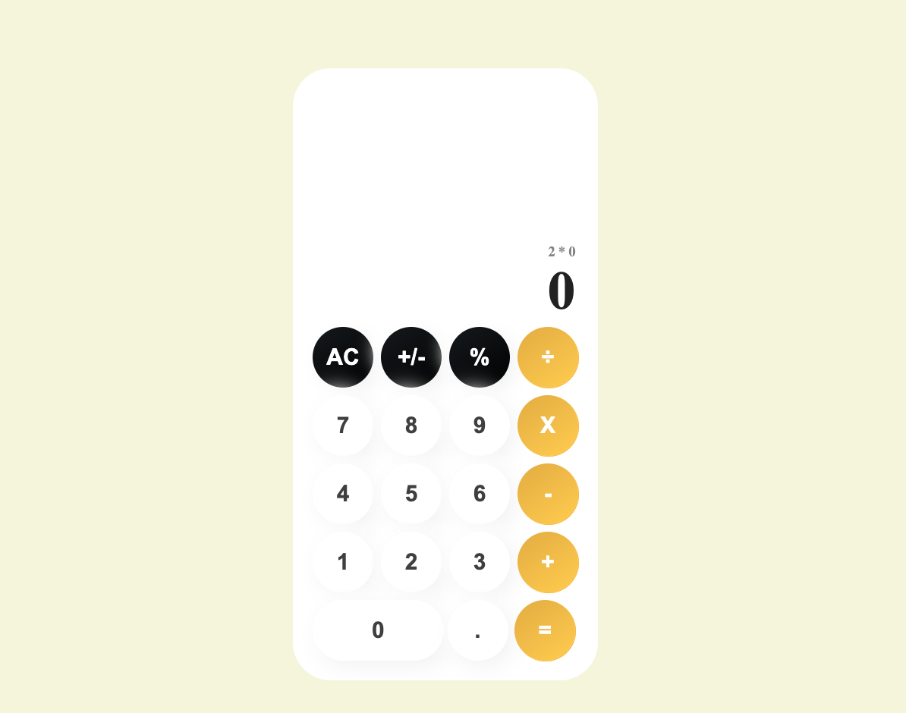

# Calculator App

### React calculator simple and advance calculator to help speed up calculations with variety of maths options, Almost any mathematical equation can be computed. 



## Getting Started

To get this project up and running in your local machine, follow these simple example steps.


## Prerequisites 

- Nodejs: >= 15.13.0

Clone repo into your local machine by running 
- `` git clone https://github.com/juxsalley/calculator-app.git `` ***in your terminal***

open project director in your terminal by  `` cd calculator-app ``

### install require dependecies 

``` npn install ```

### Run project 

`` npm run start ``

open ```localhost:3000``` in browser. 


## Live Demo

[Live](https://evening-badlands-91393.herokuapp.com/)

## **Author**

### Iddrisu Salley | Codesalley

- [\_\_salley | Twitter](https://twitter.com/__salley)
- [Iddrisu salley | LinkedIn](https://www.linkedin.com/in/dev-salley/)

## 🤝 Contributing

Contributions, issues and feature requests are welcome!

Feel free to check the [issues page](https://github.com/juxsalley/calculator-react/issues).

## Show your support

Give a ⭐️ if you like this project!
